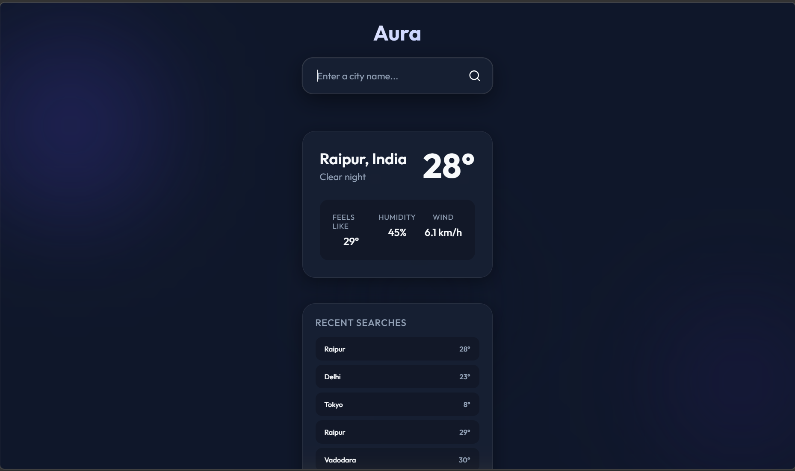

# Aura Weather 🌤️

A beautiful, seamless, full-stack weather forecasting application built with the **MERN** stack (MongoDB, Express, React, Node.js). 

Aura provides real-time weather data with a stunning glassmorphism UI and dynamic animated backgrounds that change based on the current weather conditions. It also features a "Recent Searches" history powered by a MongoDB database.

> **Note:** Don't forget to add a screenshot of your application in the repository and link it here!
> 

## ✨ Features

- **Real-time Weather Data**: Accurate forecasts including temperature, 'feels like' temperature, humidity, and wind speed.
- **Dynamic UI**: Beautiful glassmorphic design with animated mesh backgrounds that react and change colors according to the weather condition (e.g., clear skies, rain, thunderstorms) and time of day.
- **Search History**: Automatically saves your successful city searches to a MongoDB database and displays your recent searches for quick access.
- **Responsive Design**: Looks great on both desktop and mobile devices.
- **Unified Full-stack Architecture**: A single command runs both the React frontend and the Express backend concurrently.

## 🛠️ Technologies Used

- **Frontend**: React (Vite), CSS3 (Glassmorphism), standard HTML5.
- **Backend**: Node.js, Express.js.
- **Database**: MongoDB, Mongoose.
- **APIs**: [Open-Meteo API](https://open-meteo.com/) (Free, no API key required for Geocoding and Weather forecast).
- **Tools**: Axios, Concurrently.

## 🚀 Getting Started

Follow these instructions to get a copy of the project up and running on your local machine.

### Prerequisites

- [Node.js](https://nodejs.org/)
- [MongoDB](https://www.mongodb.com/try/download/community) (Running locally on the default port `27017`)

### Installation

1. **Clone the repository**
   ```bash
   git clone https://github.com/your-username/aura-weather.git
   cd aura-weather
   ```

2. **Install dependencies**
   You need to install dependencies in both the main backend directory and the React client directory.
   ```bash
   # Install backend dependencies
   npm install

   # Install frontend dependencies
   cd client
   npm install
   cd ..
   ```

3. **Start the application**
   Ensure your local MongoDB server is running. Then, from the root `aura-weather` directory, run:
   ```bash
   npm run dev
   ```
   This command starts both the Express backend server (on `http://localhost:3000`) and the Vite React development server concurrently. 

4. **View the app**
   Open your browser and navigate to the local URL provided by Vite (e.g., `http://localhost:5173`). 
   
   *Alternatively, if you build the React app (`cd client && npm run build`), the Express server will also serve the static production files on `http://localhost:3000`.*

## 📂 Project Structure

```text
aura-weather/
├── client/                 # React Frontend (Vite)
│   ├── src/
│   │   ├── components/     # React Components (Header, WeatherCard, etc.)
│   │   ├── App.jsx         # Main React Application
│   │   ├── index.css       # Core styling & glassmorphism
│   │   └── history.css     # History component styles
│   └── package.json        # Frontend dependencies
├── models/
│   └── Search.js           # Mongoose Schema for search history
├── server.js               # Express Backend server & API endpoints
└── package.json            # Backend dependencies & concurrent scripts
```

## 🤝 Contributing

Contributions, issues, and feature requests are welcome! Feel free to check the [issues page](https://github.com/your-username/aura-weather/issues).

## 📝 License

This project is licensed under the MIT License.
